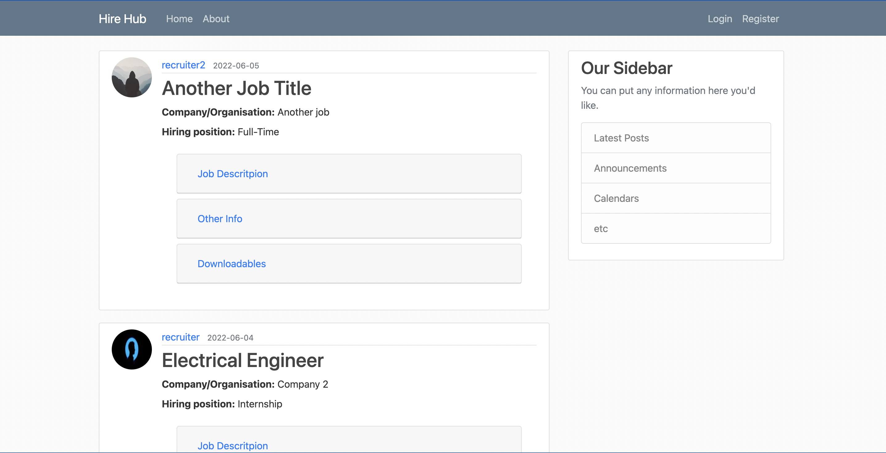
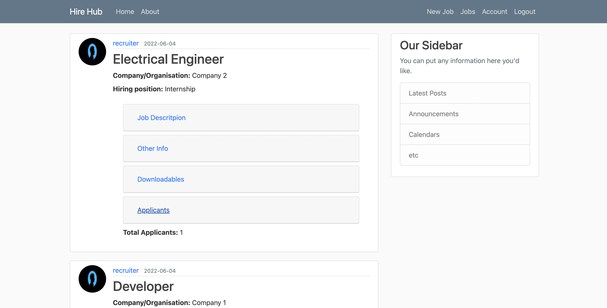
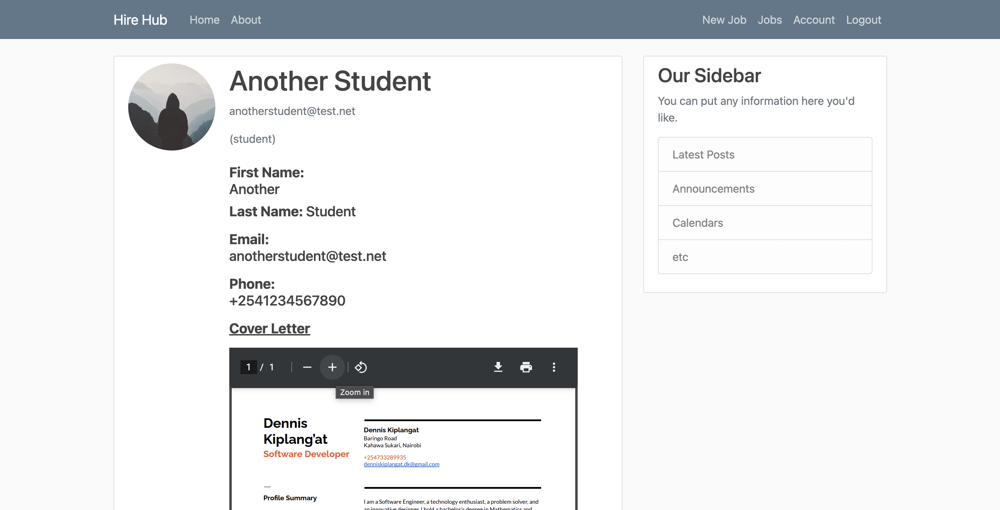

# HireHub
Mystery Recruiter will help to connect students from a University with relevant career opportunities whether that be an internship or a paid position. The application will do this by allowing students to connect with employers directly or through the aid of a teacher or professional at the university. Mystery Recruiter will allow the student to create a profile, upload their resume, and apply for positions. It will also allow employers to upload job postings and view relevant applicants. Finally, it will allow teachers and professionals from the university to send employers student profiles they deem fitting for the position. Overall we aim to provide a smooth way of connecting employers with students who possess the talents to fulfill their needs.

Users of Mystery Recruiter will be able to:
*	Choose Student/Employer/Recommender
*	Students will be able to:
*	Create profile and upload resume
*	Send applications on job postings
*	Connect with employers and recommenders
*	Employers will be able to:
*	Create job postings
*	Reach out to eligible candidates
*	Connect with students and recommenders
*	Recommenders will be able to:
*	Send recommendations to employers
*	Send job listings to students
*	Connect with students and employers
*	Admins will be able to:
*	Review user profiles
*	Manage user reports/tickets

## IMAGES

